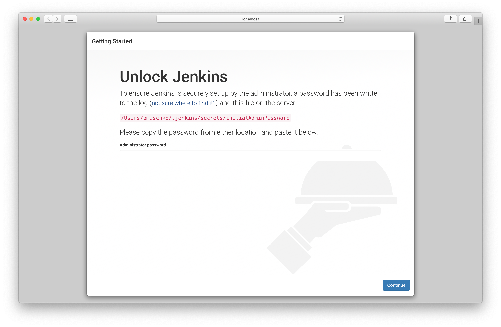
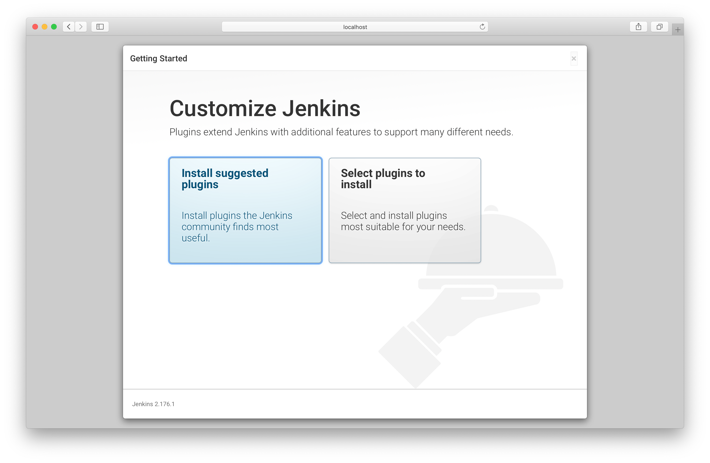
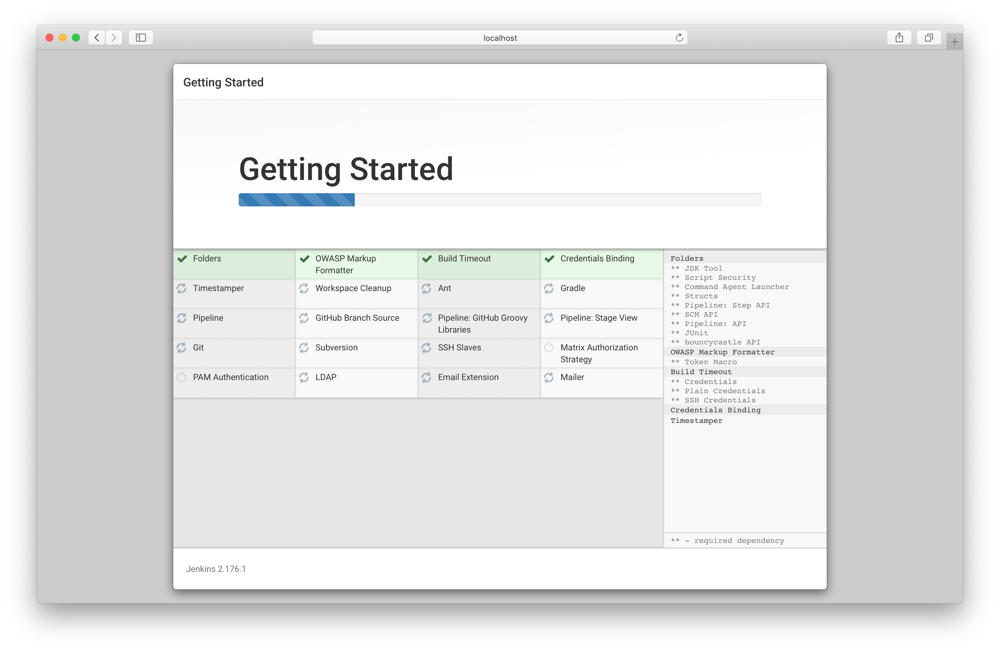
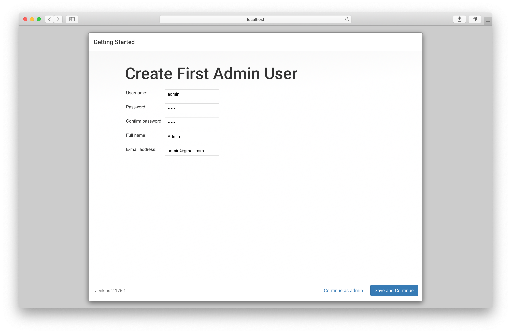
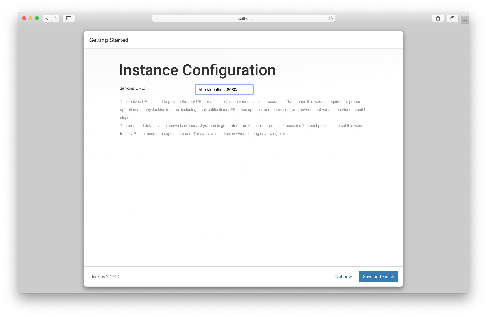
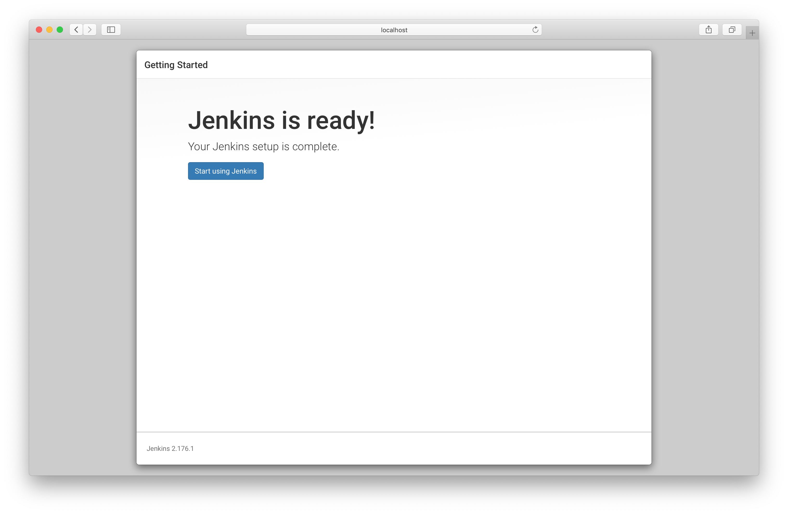
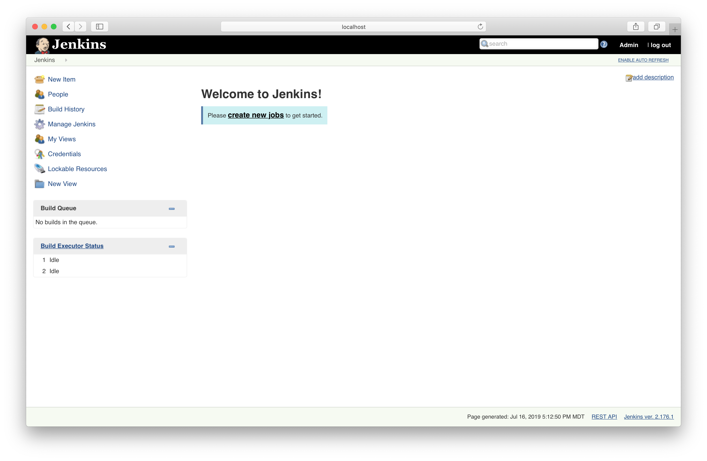

# Solution

Download the WAR file with the help of `wget`.

```bash
wget http://mirrors.jenkins.io/war-stable/latest/jenkins.war
--2019-08-09 16:06:23--  http://mirrors.jenkins.io/war-stable/latest/jenkins.war
Resolving mirrors.jenkins.io (mirrors.jenkins.io)... 52.202.51.185
Connecting to mirrors.jenkins.io (mirrors.jenkins.io)|52.202.51.185|:80... connected.
HTTP request sent, awaiting response... 302 Found
Location: http://mirror.xmission.com/jenkins/war-stable/2.176.2/jenkins.war [following]
--2019-08-09 16:06:23--  http://mirror.xmission.com/jenkins/war-stable/2.176.2/jenkins.war
Resolving mirror.xmission.com (mirror.xmission.com)... 2607:fa18:0:3::13, 198.60.22.13
Connecting to mirror.xmission.com (mirror.xmission.com)|2607:fa18:0:3::13|:80... connected.
HTTP request sent, awaiting response... 200 OK
Length: 77379386 (74M) [application/java-archive]
Saving to: ‘jenkins.war’

jenkins.war                   100%[=================================================>]  73.79M  6.46MB/s    in 14s

2019-08-09 16:06:37 (5.36 MB/s) - ‘jenkins.war’ saved [77379386/77379386]
```

First, start the Jenkins server. Copy the password printed in the log output to the clipboard.

```bash
$ java -jar jenkins.war
Running from: /Users/bmuschko/dev/tools/jenkins-2.150.1/jenkins.war
webroot: $user.home/.jenkins
Jul 16, 2019 4:59:30 PM org.eclipse.jetty.util.log.Log initialized
INFO: Logging initialized @501ms to org.eclipse.jetty.util.log.JavaUtilLog
Jul 16, 2019 4:59:30 PM winstone.Logger logInternal
INFO: Beginning extraction from war file
Jul 16, 2019 4:59:32 PM org.eclipse.jetty.server.handler.ContextHandler setContextPath
WARNING: Empty contextPath
Jul 16, 2019 4:59:32 PM org.eclipse.jetty.server.Server doStart
INFO: jetty-9.4.z-SNAPSHOT; built: 2019-02-15T16:53:49.381Z; git: eb70b240169fcf1abbd86af36482d1c49826fa0b; jvm 1.8.0_181-b13
Jul 16, 2019 4:59:32 PM org.eclipse.jetty.webapp.StandardDescriptorProcessor visitServlet
INFO: NO JSP Support for /, did not find org.eclipse.jetty.jsp.JettyJspServlet
Jul 16, 2019 4:59:32 PM org.eclipse.jetty.server.session.DefaultSessionIdManager doStart
INFO: DefaultSessionIdManager workerName=node0
Jul 16, 2019 4:59:32 PM org.eclipse.jetty.server.session.DefaultSessionIdManager doStart
INFO: No SessionScavenger set, using defaults
Jul 16, 2019 4:59:32 PM org.eclipse.jetty.server.session.HouseKeeper startScavenging
INFO: node0 Scavenging every 660000ms
Jenkins home directory: /Users/bmuschko/.jenkins found at: $user.home/.jenkins
Jul 16, 2019 4:59:34 PM org.eclipse.jetty.server.handler.ContextHandler doStart
INFO: Started w.@21ec5d87{Jenkins v2.176.1,/,file:///Users/bmuschko/.jenkins/war/,AVAILABLE}{/Users/bmuschko/.jenkins/war}
Jul 16, 2019 4:59:34 PM org.eclipse.jetty.server.AbstractConnector doStart
INFO: Started ServerConnector@388ffbc2{HTTP/1.1,[http/1.1]}{0.0.0.0:8080}
Jul 16, 2019 4:59:34 PM org.eclipse.jetty.server.Server doStart
INFO: Started @4486ms
Jul 16, 2019 4:59:34 PM winstone.Logger logInternal
INFO: Winstone Servlet Engine v4.0 running: controlPort=disabled
Jul 16, 2019 4:59:35 PM jenkins.InitReactorRunner$1 onAttained
INFO: Started initialization
Jul 16, 2019 4:59:35 PM jenkins.InitReactorRunner$1 onAttained
INFO: Listed all plugins
Jul 16, 2019 4:59:36 PM jenkins.InitReactorRunner$1 onAttained
INFO: Prepared all plugins
Jul 16, 2019 4:59:36 PM jenkins.InitReactorRunner$1 onAttained
INFO: Started all plugins
Jul 16, 2019 4:59:36 PM jenkins.InitReactorRunner$1 onAttained
INFO: Augmented all extensions
Jul 16, 2019 4:59:37 PM jenkins.InitReactorRunner$1 onAttained
INFO: Loaded all jobs
Jul 16, 2019 4:59:37 PM hudson.model.AsyncPeriodicWork$1 run
INFO: Started Download metadata
Jul 16, 2019 4:59:37 PM hudson.util.Retrier start
INFO: Attempt #1 to do the action check updates server
Jul 16, 2019 4:59:38 PM org.springframework.context.support.AbstractApplicationContext prepareRefresh
INFO: Refreshing org.springframework.web.context.support.StaticWebApplicationContext@54fe6e54: display name [Root WebApplicationContext]; startup date [Tue Jul 16 16:59:38 MDT 2019]; root of context hierarchy
Jul 16, 2019 4:59:38 PM org.springframework.context.support.AbstractApplicationContext obtainFreshBeanFactory
INFO: Bean factory for application context [org.springframework.web.context.support.StaticWebApplicationContext@54fe6e54]: org.springframework.beans.factory.support.DefaultListableBeanFactory@3e77b308
Jul 16, 2019 4:59:38 PM org.springframework.beans.factory.support.DefaultListableBeanFactory preInstantiateSingletons
INFO: Pre-instantiating singletons in org.springframework.beans.factory.support.DefaultListableBeanFactory@3e77b308: defining beans [authenticationManager]; root of factory hierarchy
Jul 16, 2019 4:59:38 PM org.springframework.context.support.AbstractApplicationContext prepareRefresh
INFO: Refreshing org.springframework.web.context.support.StaticWebApplicationContext@2b22ca16: display name [Root WebApplicationContext]; startup date [Tue Jul 16 16:59:38 MDT 2019]; root of context hierarchy
Jul 16, 2019 4:59:38 PM org.springframework.context.support.AbstractApplicationContext obtainFreshBeanFactory
INFO: Bean factory for application context [org.springframework.web.context.support.StaticWebApplicationContext@2b22ca16]: org.springframework.beans.factory.support.DefaultListableBeanFactory@28d4e2d4
Jul 16, 2019 4:59:38 PM org.springframework.beans.factory.support.DefaultListableBeanFactory preInstantiateSingletons
INFO: Pre-instantiating singletons in org.springframework.beans.factory.support.DefaultListableBeanFactory@28d4e2d4: defining beans [filter,legacy]; root of factory hierarchy
Jul 16, 2019 4:59:38 PM jenkins.install.SetupWizard init
INFO:

*************************************************************
*************************************************************
*************************************************************

Jenkins initial setup is required. An admin user has been created and a password generated.
Please use the following password to proceed to installation:

34155b26571e4a2eb6eca68ddc4d5749

This may also be found at: /Users/bmuschko/.jenkins/secrets/initialAdminPassword

*************************************************************
*************************************************************
*************************************************************

Jul 16, 2019 4:59:42 PM hudson.model.UpdateSite updateData
INFO: Obtained the latest update center data file for UpdateSource default
Jul 16, 2019 4:59:42 PM hudson.model.UpdateSite updateData
INFO: Obtained the latest update center data file for UpdateSource default
Jul 16, 2019 4:59:43 PM jenkins.InitReactorRunner$1 onAttained
INFO: Completed initialization
Jul 16, 2019 4:59:43 PM hudson.model.DownloadService$Downloadable load
INFO: Obtained the updated data file for hudson.tasks.Maven.MavenInstaller
Jul 16, 2019 4:59:43 PM hudson.util.Retrier start
INFO: Performed the action check updates server successfully at the attempt #1
Jul 16, 2019 4:59:43 PM hudson.model.AsyncPeriodicWork$1 run
INFO: Finished Download metadata. 5,856 ms
Jul 16, 2019 4:59:43 PM hudson.UDPBroadcastThread run
INFO: Cannot listen to UDP port 33,848, skipping: java.net.SocketException: Can't assign requested address
Jul 16, 2019 4:59:43 PM hudson.WebAppMain$3 run
INFO: Jenkins is fully up and running
```

Paste the password from the clipboard into the password field.



Select the option to install recommended plugins.



The installation process will run for a couple of minutes.



Enter credentials for your first admin user.



Skip over the instance configuration step.



Jenkins indicates that it is ready for use.



The installation process is complete. You should land on the dashboard.

