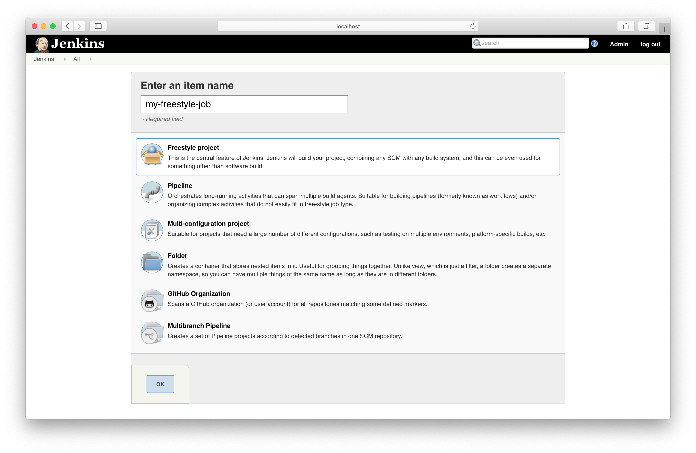
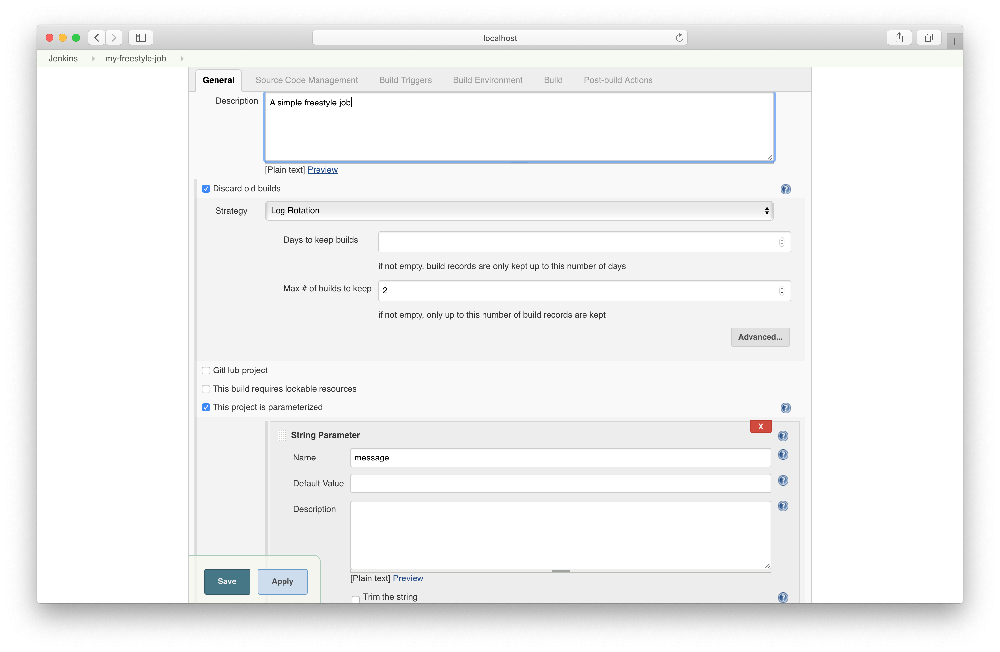
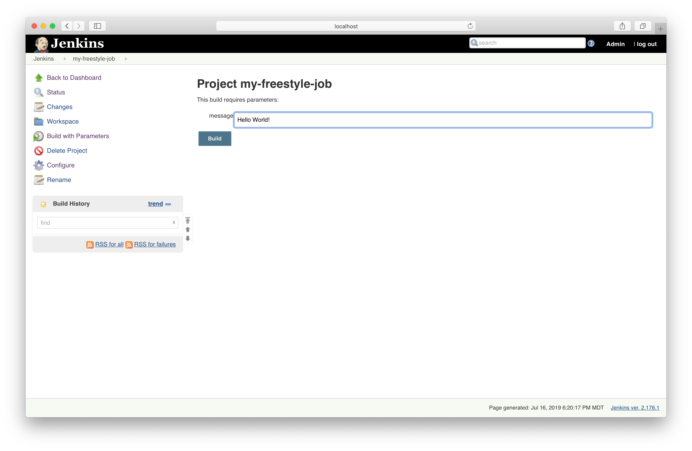
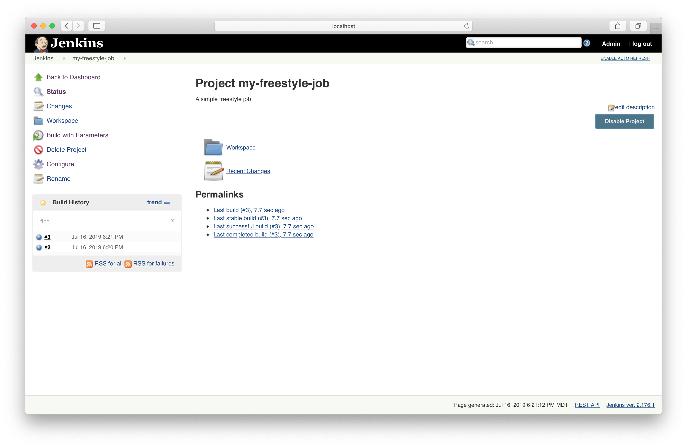
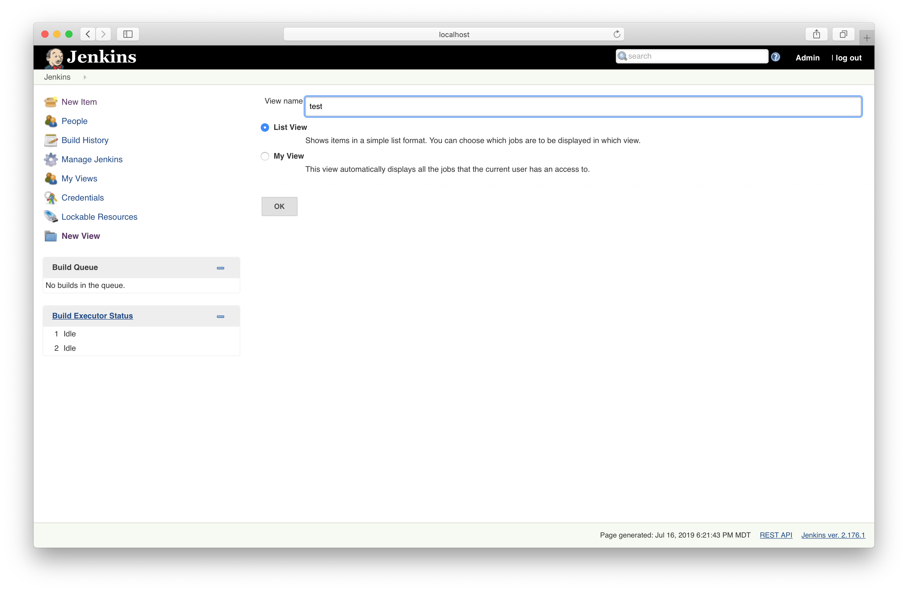
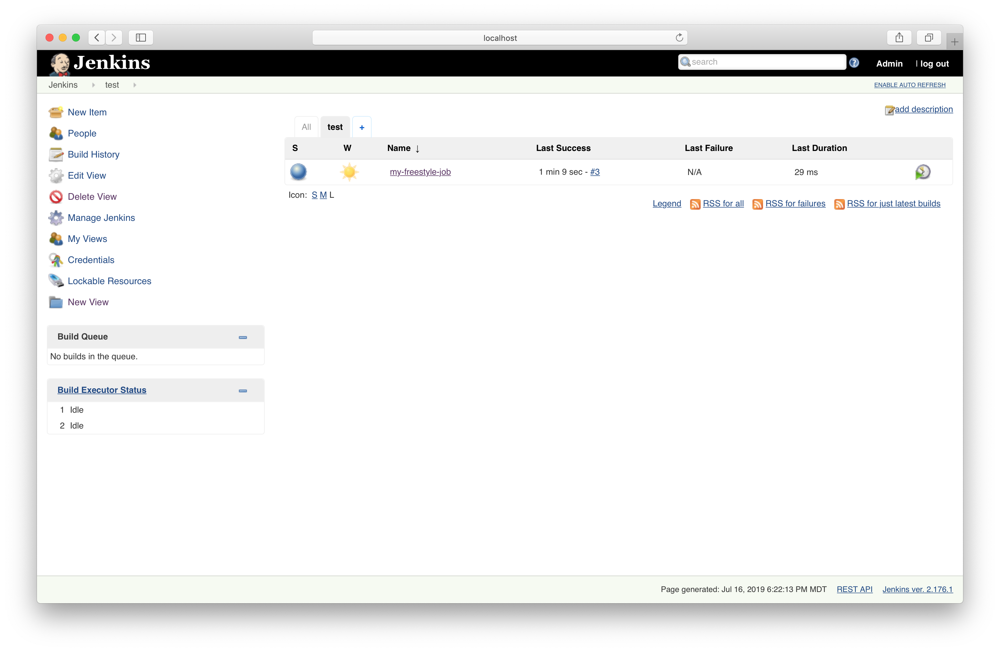
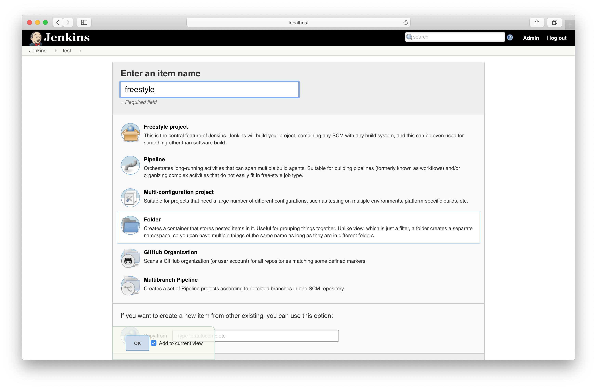
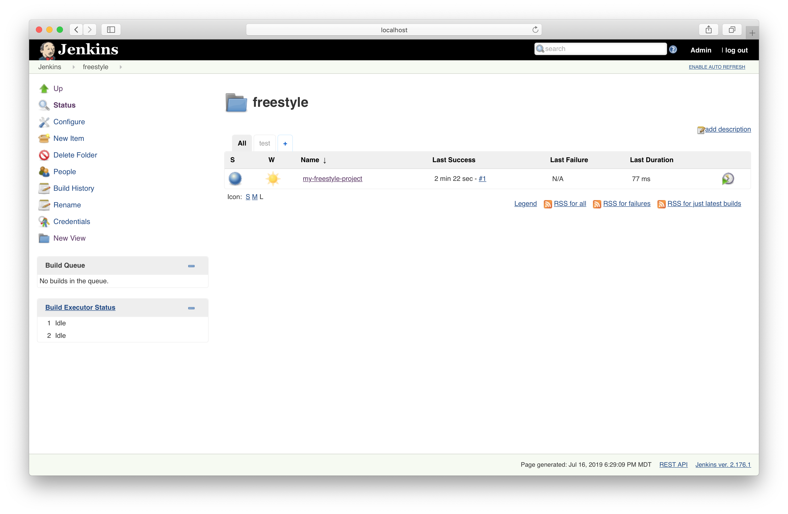

# Solution

We'll start by creating the new freestyle job.



Configure the job as follows.



The build will ask for a parameter value when triggered.



The build history only stores the previous two builds.



Create a new view.



After adding the job to the view, it will show up in a separate tab.



Create a new folder.



The job became a child of the folder after moving it there.



Navigating to the `job` directory under the Jenkins Home reveals the build history.

```bash
$ cd /Users/bmuschko/.jenkins/jobs/freestyle/jobs
$ tree my-freestyle-job
my-freestyle-job
├── builds
│   ├── 1
│   │   ├── build.xml
│   │   ├── changelog.xml
│   │   └── log
│   ├── 2
│   │   ├── build.xml
│   │   ├── changelog.xml
│   │   └── log
│   ├── 3
│   │   ├── build.xml
│   │   ├── changelog.xml
│   │   └── log
│   ├── lastFailedBuild -> -1
│   ├── lastStableBuild -> 3
│   ├── lastSuccessfulBuild -> 3
│   ├── lastUnstableBuild -> -1
│   ├── lastUnsuccessfulBuild -> -1
│   └── legacyIds
├── config.xml
├── lastStable -> builds/lastStableBuild
├── lastSuccessful -> builds/lastSuccessfulBuild
└── nextBuildNumber

8 directories, 15 files
```