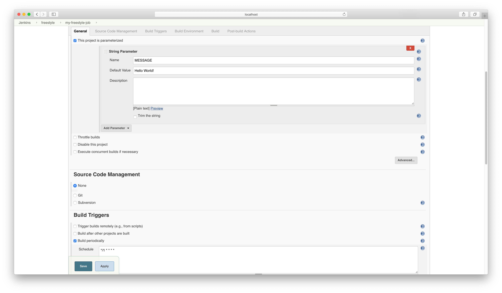
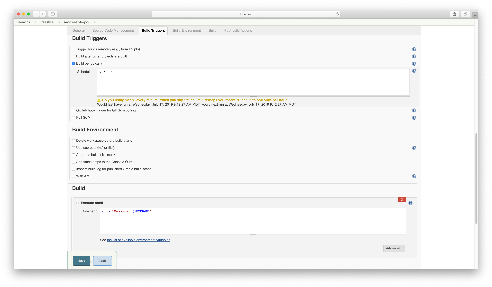
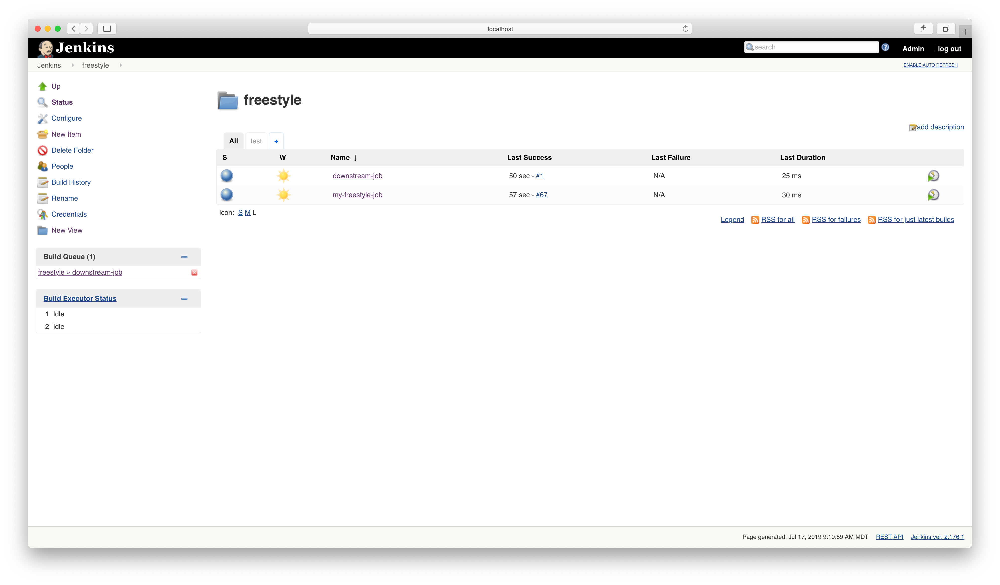
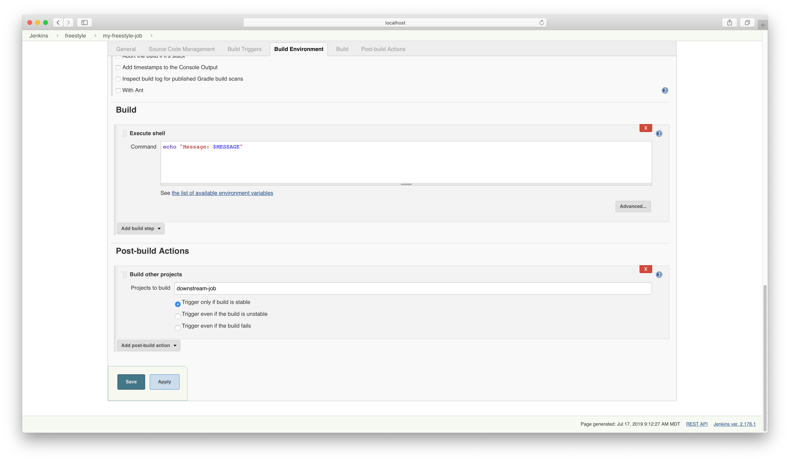
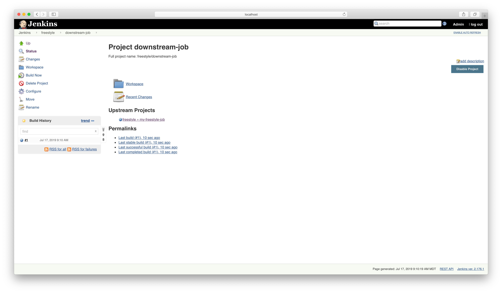

# Solution

Modify the existing build parameter.



Add the cron build trigger and the build step.



The output render the interpolated value of the `echo` command.

```bash
Started by timer
Running as SYSTEM
Building in workspace /Users/bmuschko/.jenkins/workspace/freestyle/my-freestyle-job
[my-freestyle-job] $ /bin/sh -xe /var/folders/02/3dgzjkqj4kz0g7lnrk0w93c00000gn/T/jenkins3548490840940668236.sh
+ echo "Message: Hello World!"
Message: Hello World!
Finished: SUCCESS
```

Create a new job in the same folder.



Configure the downstream job from the initial job.



The downstream job indicates the upstream job.

