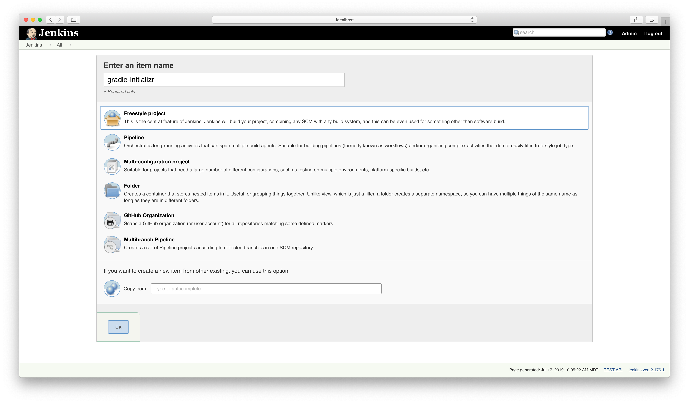
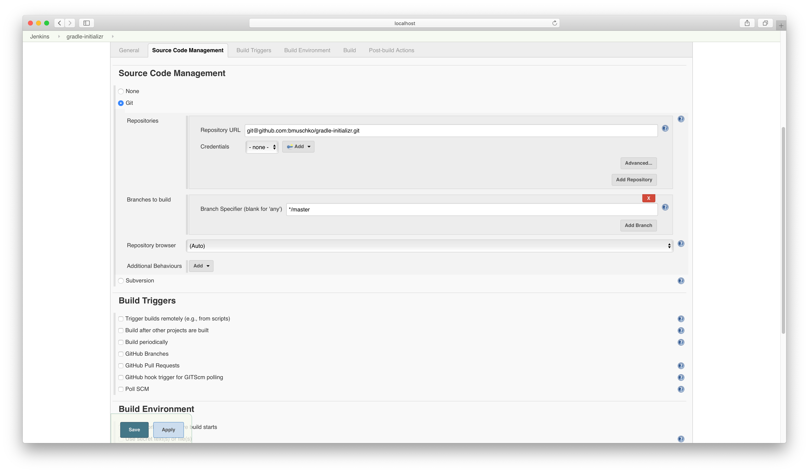
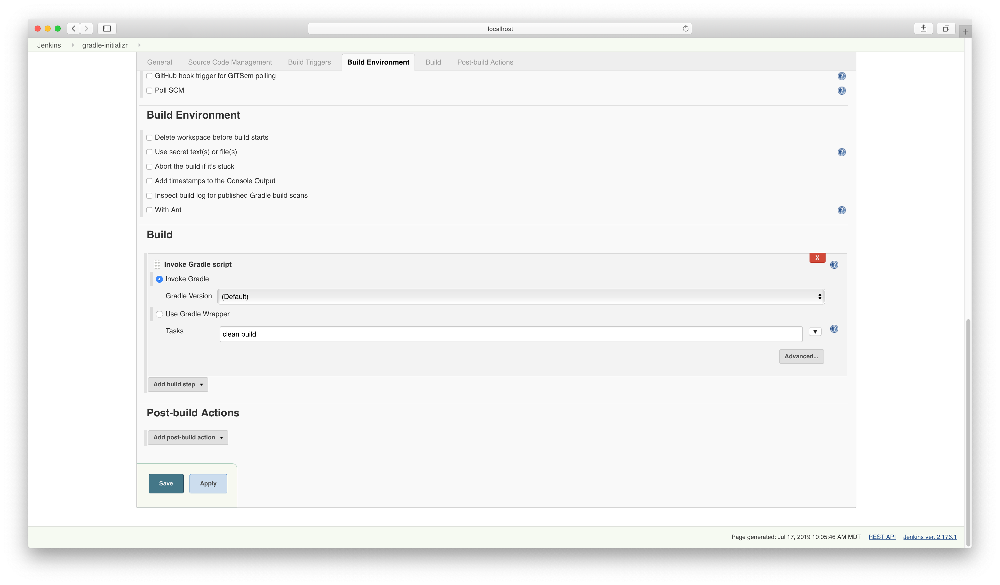

# Solution

Create a new job.



Configure the Git SCM and point the proper URL. The default is the `master` branch.



Create the Gradle build step. Ensure to select the "Use Gradle Wrapper" option.



The build log should look similar to the output below.

```bash
Started by user Admin
Running as SYSTEM
Building in workspace /Users/bmuschko/.jenkins/workspace/gradle-initializr
No credentials specified
Cloning the remote Git repository
Cloning repository git@github.com:bmuschko/gradle-initializr.git
 > git init /Users/bmuschko/.jenkins/workspace/gradle-initializr # timeout=10
Fetching upstream changes from git@github.com:bmuschko/gradle-initializr.git
 > git --version # timeout=10
 > git fetch --tags --force --progress git@github.com:bmuschko/gradle-initializr.git +refs/heads/*:refs/remotes/origin/*
 > git config remote.origin.url git@github.com:bmuschko/gradle-initializr.git # timeout=10
 > git config --add remote.origin.fetch +refs/heads/*:refs/remotes/origin/* # timeout=10
 > git config remote.origin.url git@github.com:bmuschko/gradle-initializr.git # timeout=10
Fetching upstream changes from git@github.com:bmuschko/gradle-initializr.git
 > git fetch --tags --force --progress git@github.com:bmuschko/gradle-initializr.git +refs/heads/*:refs/remotes/origin/*
 > git rev-parse refs/remotes/origin/master^{commit} # timeout=10
 > git rev-parse refs/remotes/origin/origin/master^{commit} # timeout=10
Checking out Revision 8e725ea3507f5ac0f8251234e1ff0f214b228d3d (refs/remotes/origin/master)
 > git config core.sparsecheckout # timeout=10
 > git checkout -f 8e725ea3507f5ac0f8251234e1ff0f214b228d3d
Commit message: "Update docs"
First time build. Skipping changelog.
[Gradle] - Launching build.
[gradle-initializr] $ gradle clean build
Starting a Gradle Daemon (subsequent builds will be faster)
> Task :clean UP-TO-DATE
> Task :compileJava
> Task :compileGroovy NO-SOURCE
> Task :processResources
> Task :classes
> Task :bootJar
> Task :jar SKIPPED
> Task :assemble
> Task :compileTestJava NO-SOURCE
> Task :compileTestGroovy
> Task :processTestResources NO-SOURCE
> Task :testClasses
> Task :test
> Task :compileIntegrationTestJava NO-SOURCE
> Task :compileIntegrationTestGroovy
> Task :processIntegrationTestResources NO-SOURCE
> Task :integrationTestClasses
> Task :integrationTest
2019-07-17 10:07:48.803  INFO 67741 --- [       Thread-6] o.s.s.concurrent.ThreadPoolTaskExecutor  : Shutting down ExecutorService 'applicationTaskExecutor'
> Task :check
> Task :build

BUILD SUCCESSFUL in 30s
8 actionable tasks: 7 executed, 1 up-to-date
Build step 'Invoke Gradle script' changed build result to SUCCESS
Finished: SUCCESS
```

**As a side note:** The GitHub plugin is [currently broken](https://issues.jenkins-ci.org/browse/JENKINS-11337) if you wanted to build multiple branches with a single job. You will have to model it as a multi-branch pipeline job.