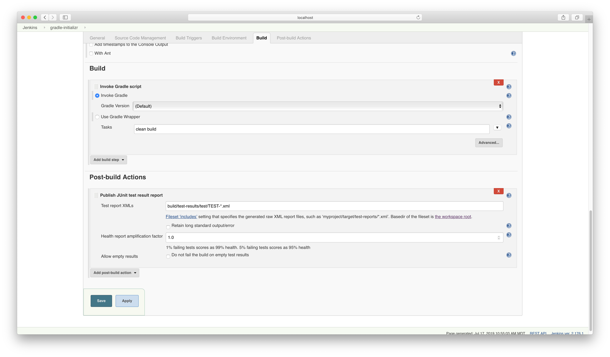
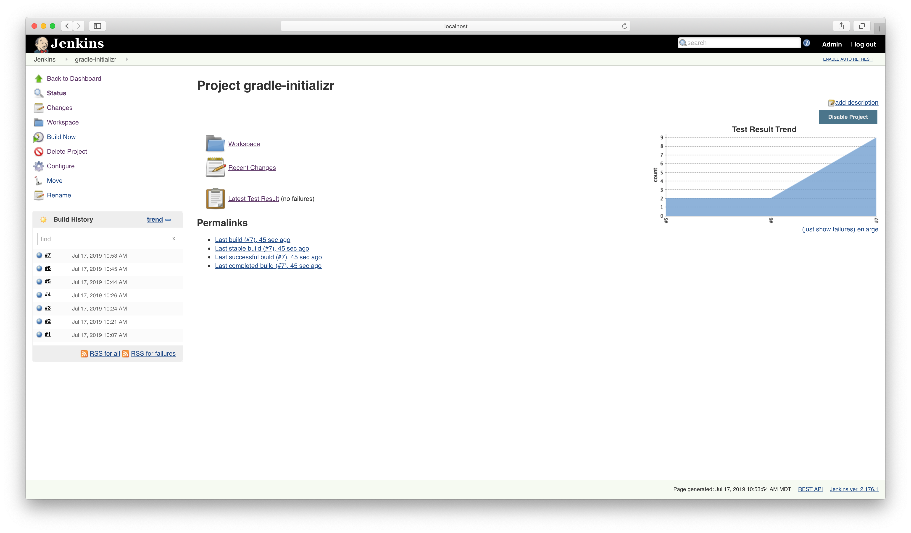
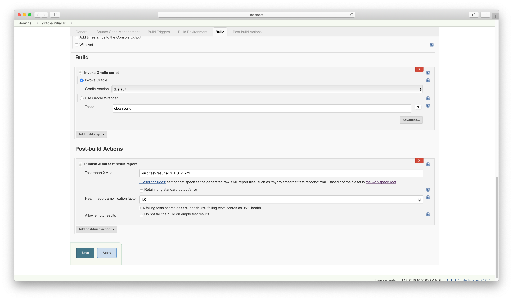
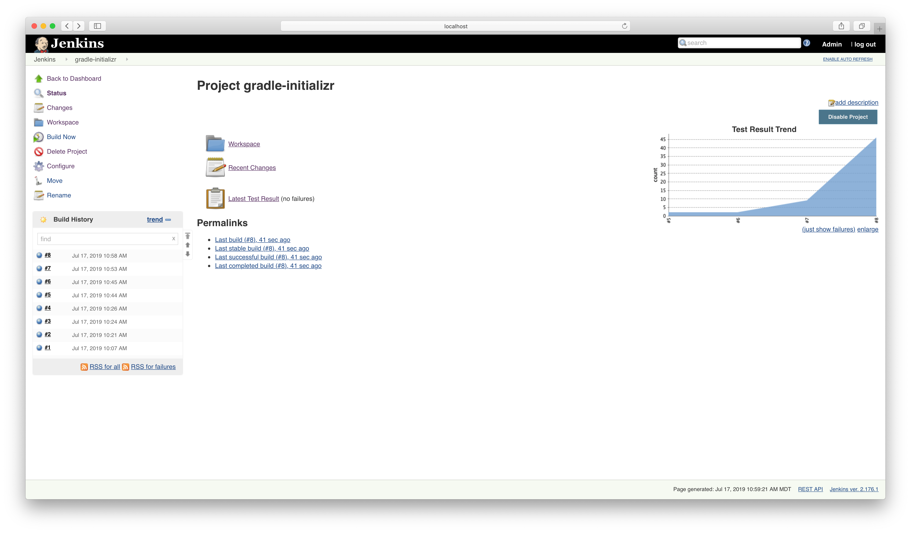
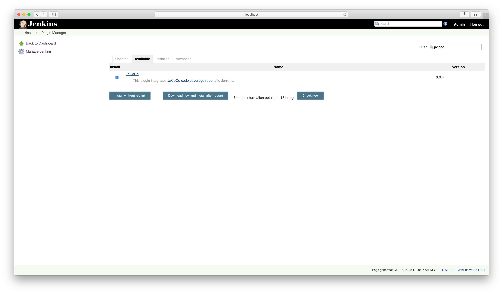
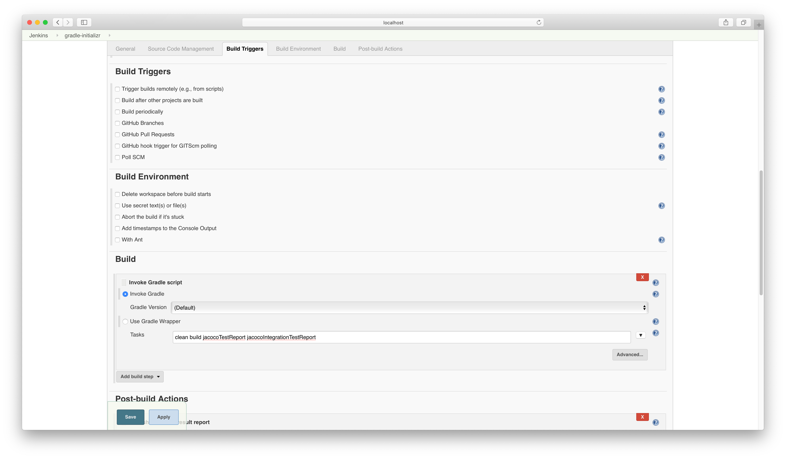
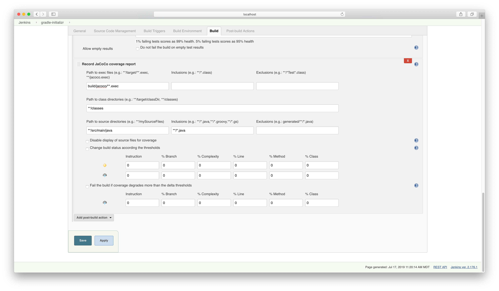
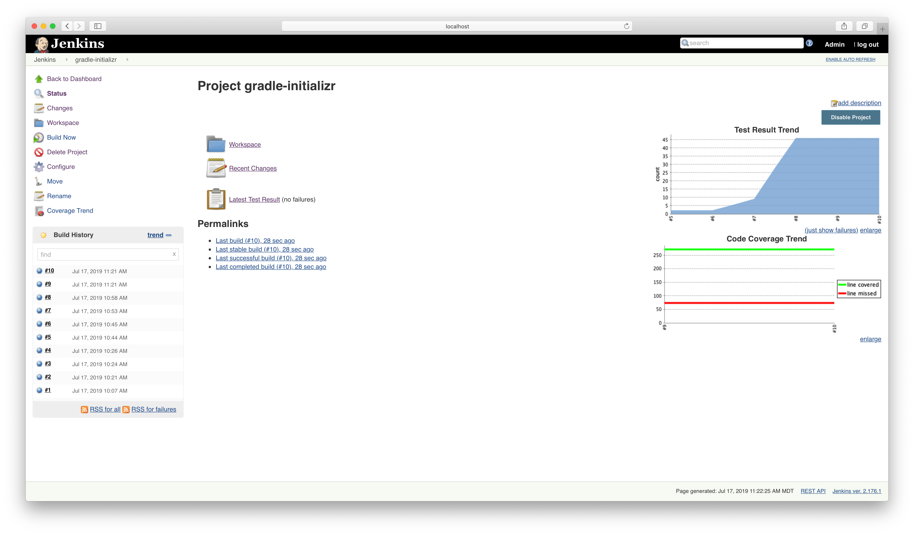
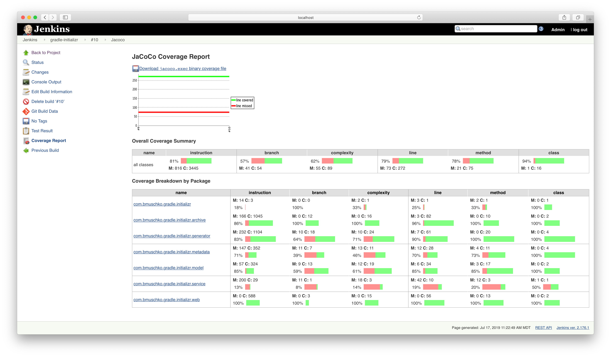

# Solution

Publish the JUnit reports by pointing to the exact directory containing the XML files.

After executing the build twice you will see a test result trend graph.

Publish the JUnit reporting by using a wild card.

The trend changes accordingly.

Install the JaCoCo plugin from the Plugin Manager page.

Change the task list executed by the Gradle build step.

Configure JaCoCo reporting.

The JaCoCo coverage trend renders after executing the build twice.

You can drill into the details of the report.

