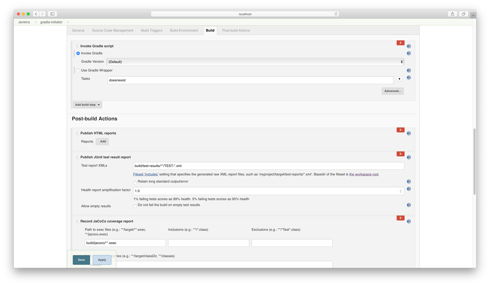
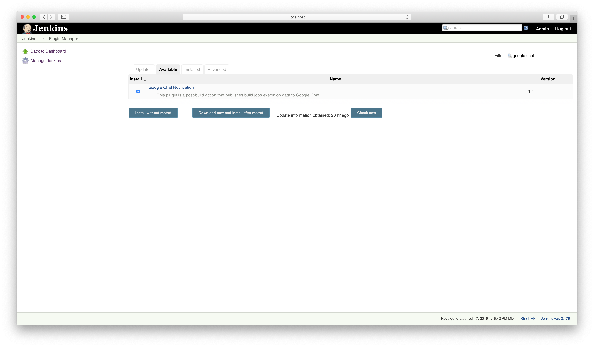
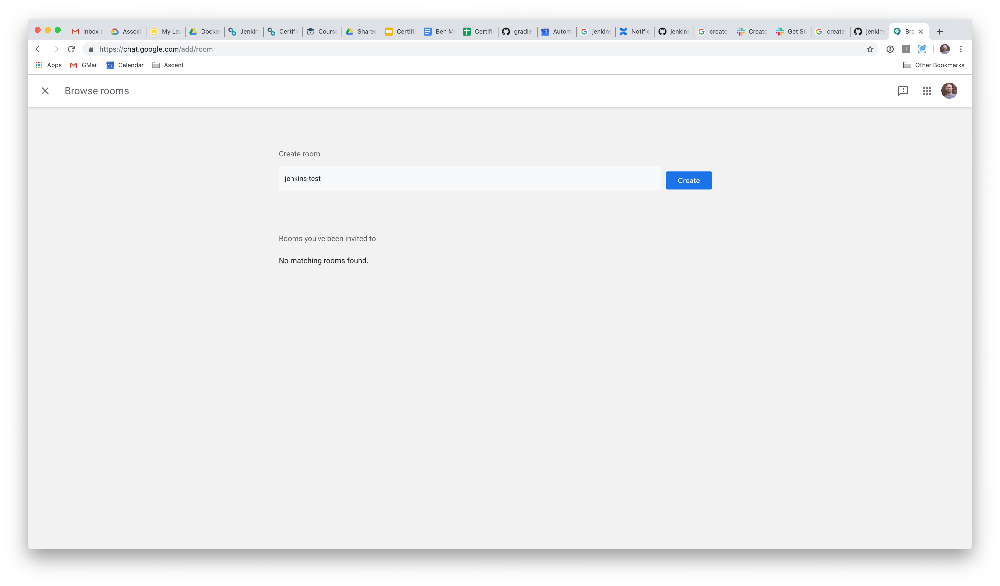
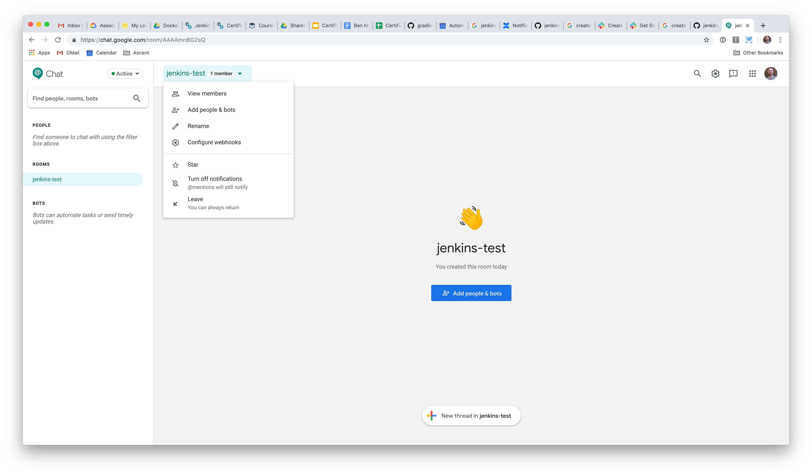
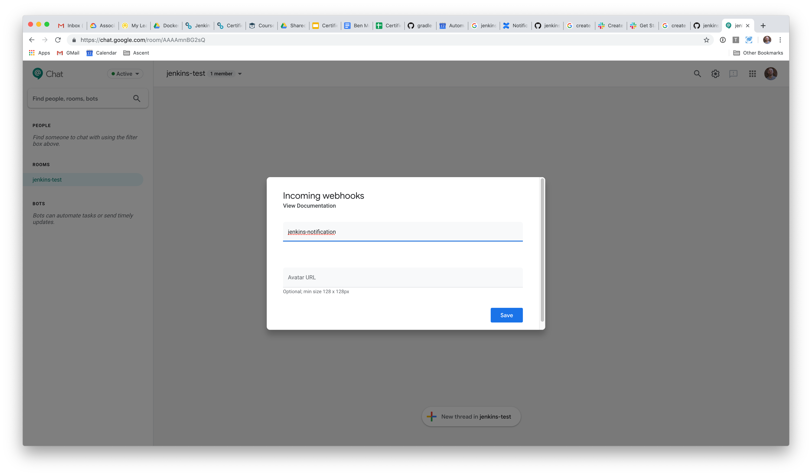
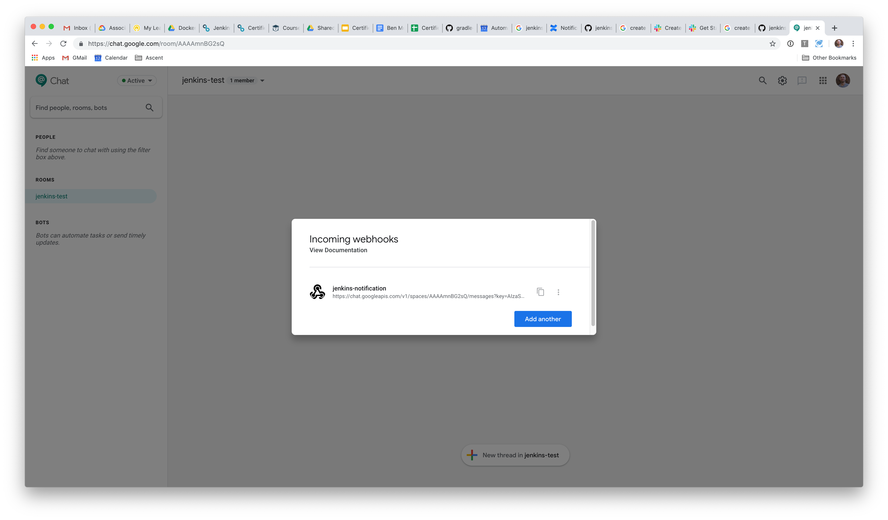
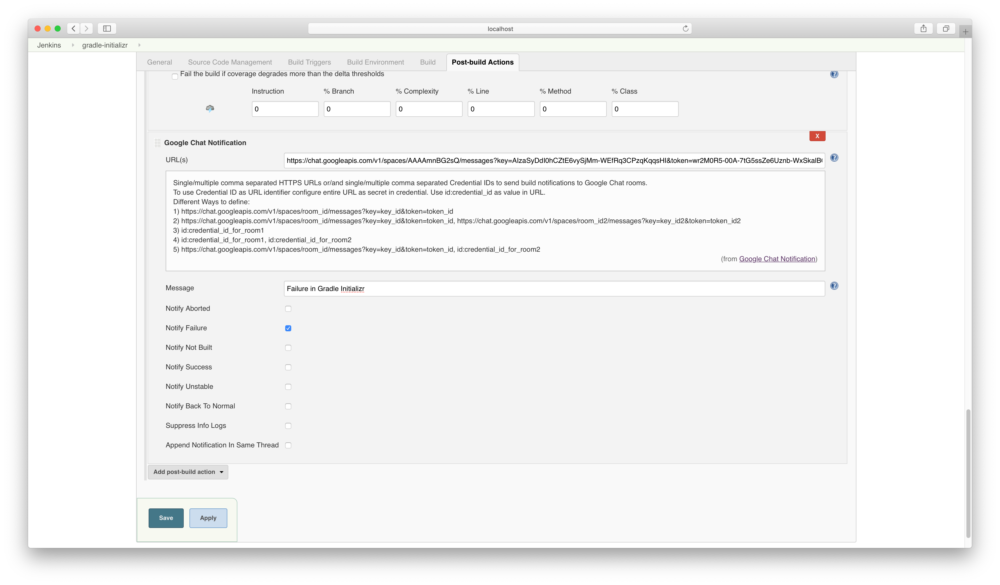
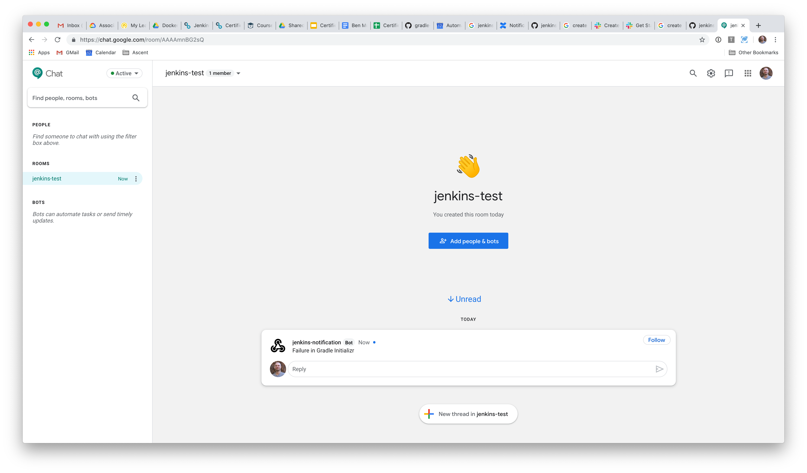

# Solution

Change the list of Gradle tasks first.

Find the plugin and install it.

Add a new chat room.

For the chat room, click the little cog icon and create a new webhook.

Enter an appropriate name for the webhook.

Copy the generate webhook URL to the clipboard.

In the Jenkins job, create a new Google Chat notification. Add the webhook URL and provide a name.

Run a build. It should fail and send a new message to the chat room.

