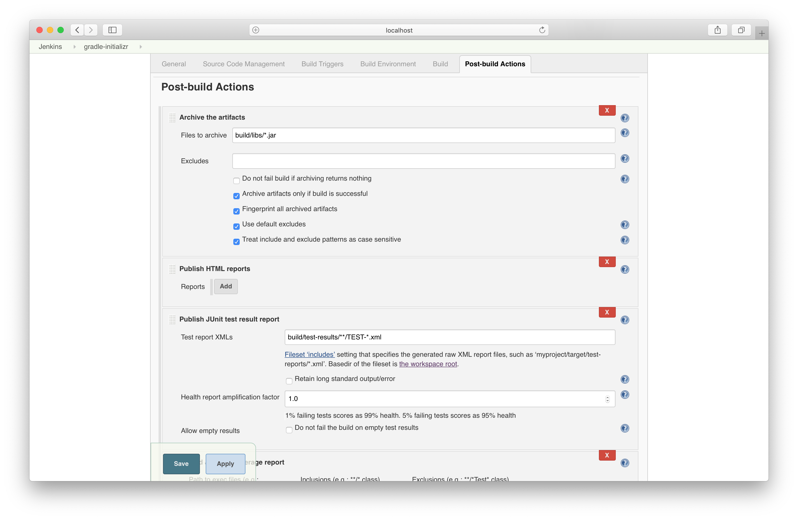
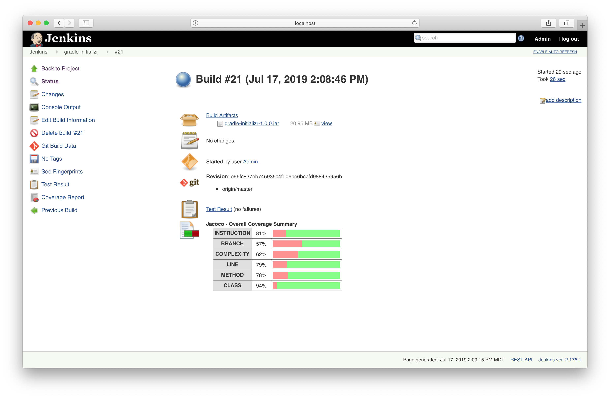
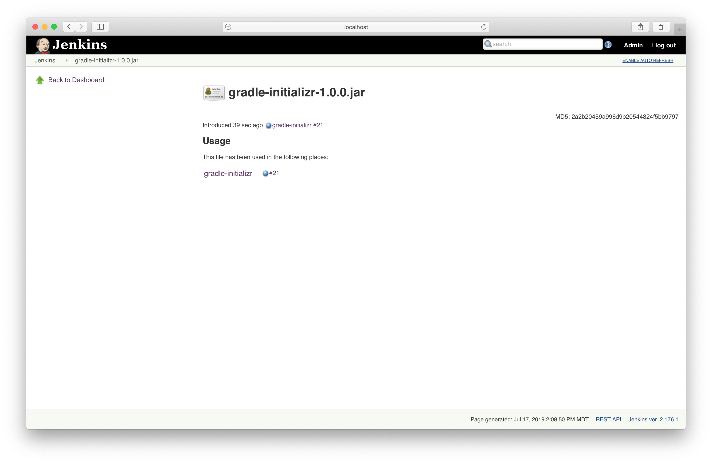
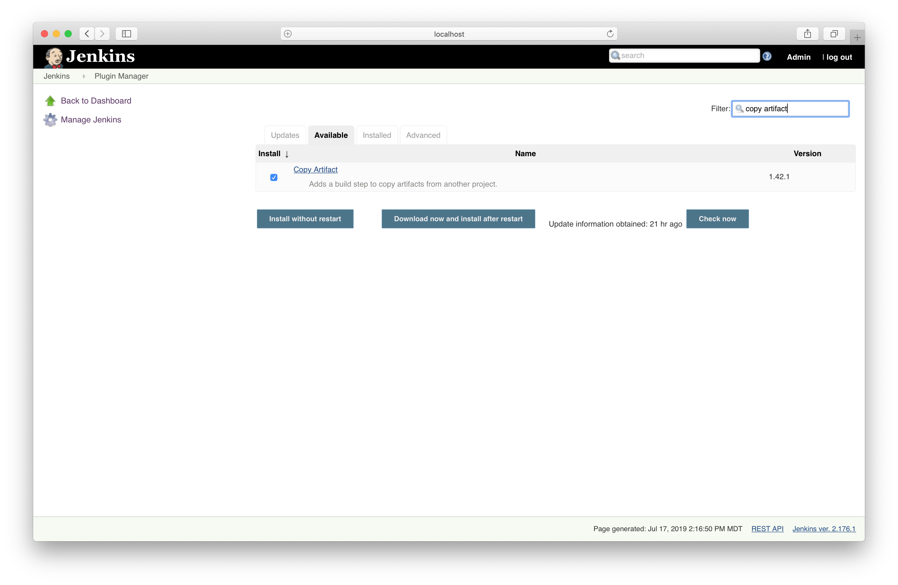
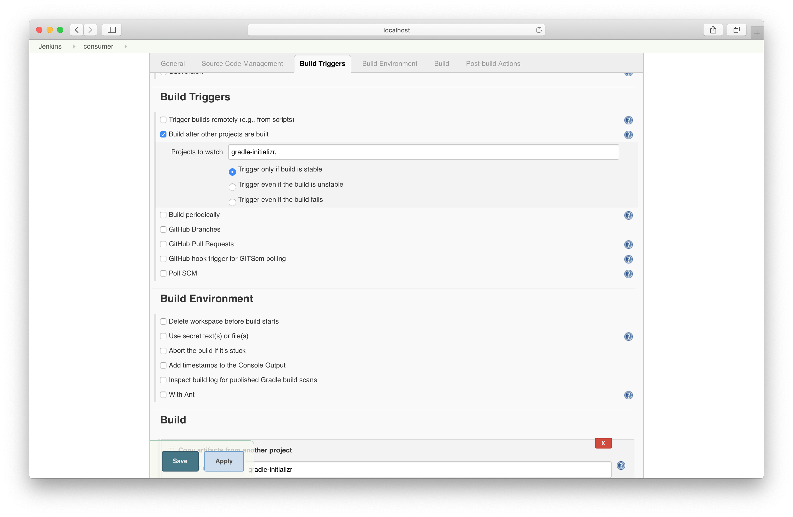
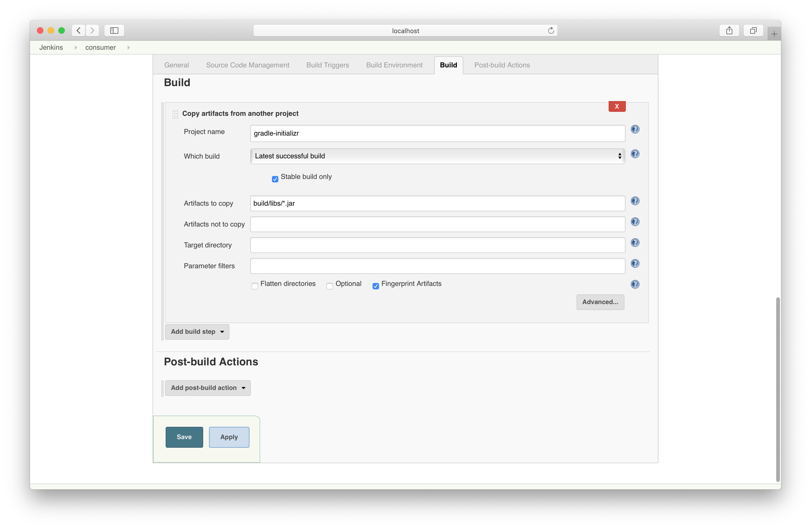
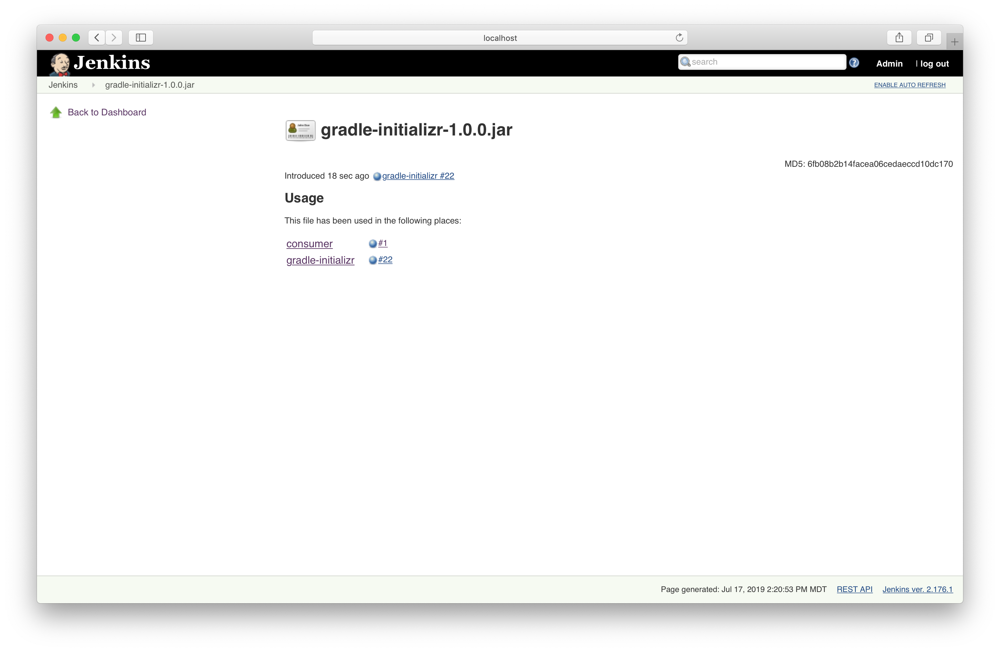

# Solution

In the job configuration, archive the artifact produced by the build. Check the box for generating fingerprints.

Execute the build and find the archived artifact.

Have a look at the details of the fingerprinting.

Install the Copy Artifacts plugin from the Plugin Manager page.

Trigger the downstream job upon success.

Copy artifacts from the upstream job.

You can see the full usage of the artifact in upstream and downstream jobs.

