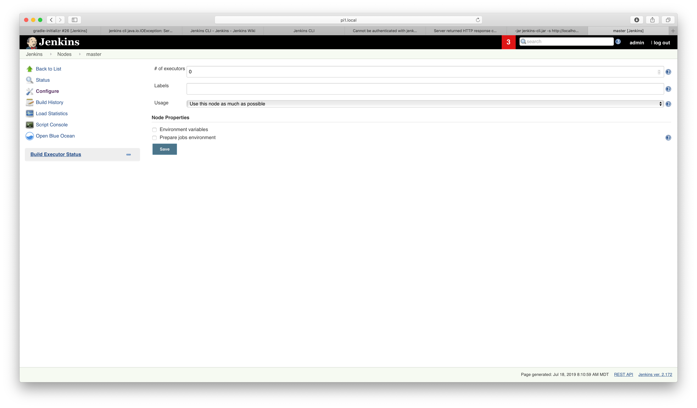
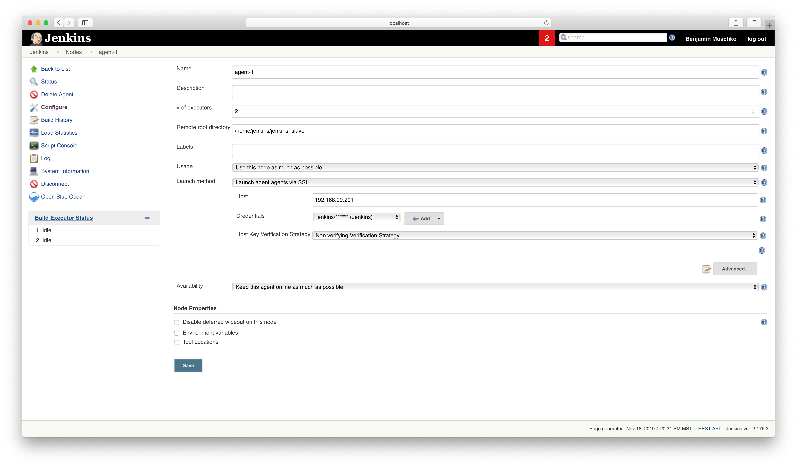
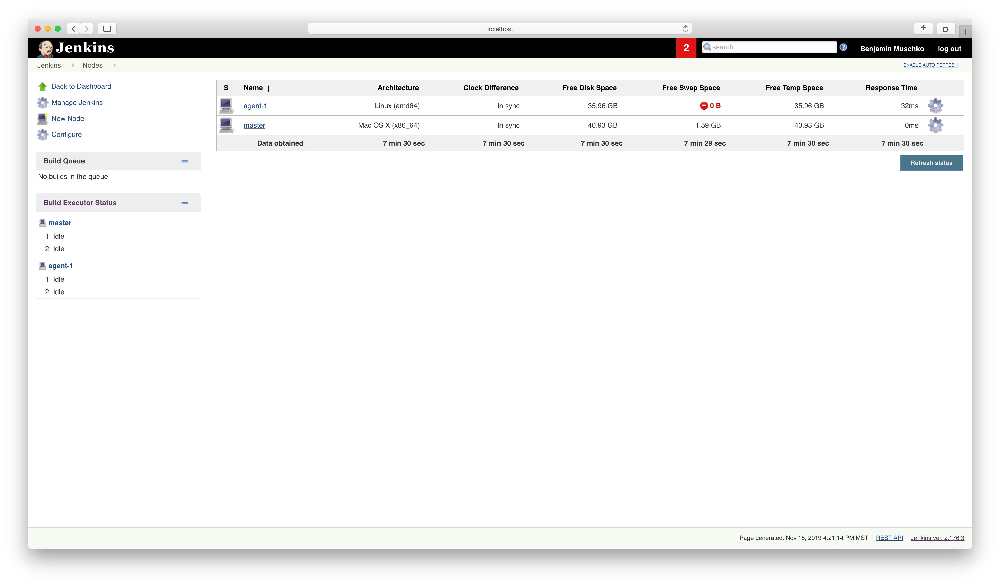
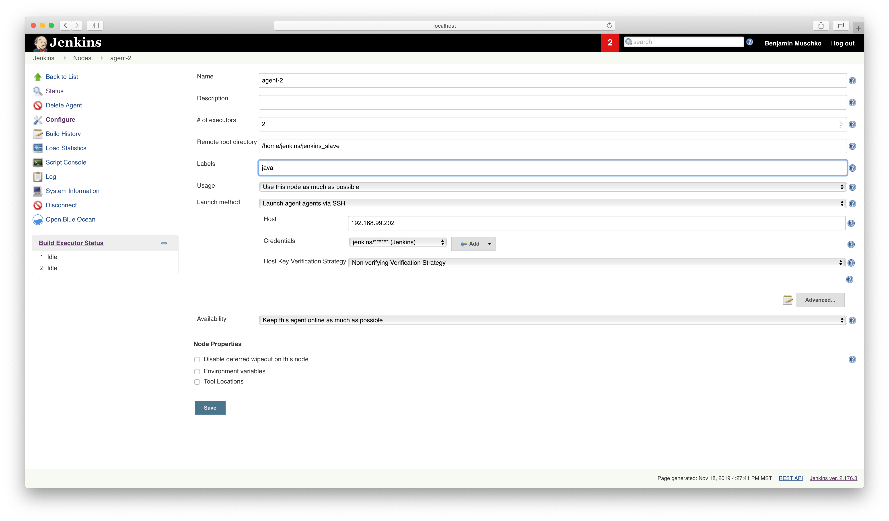
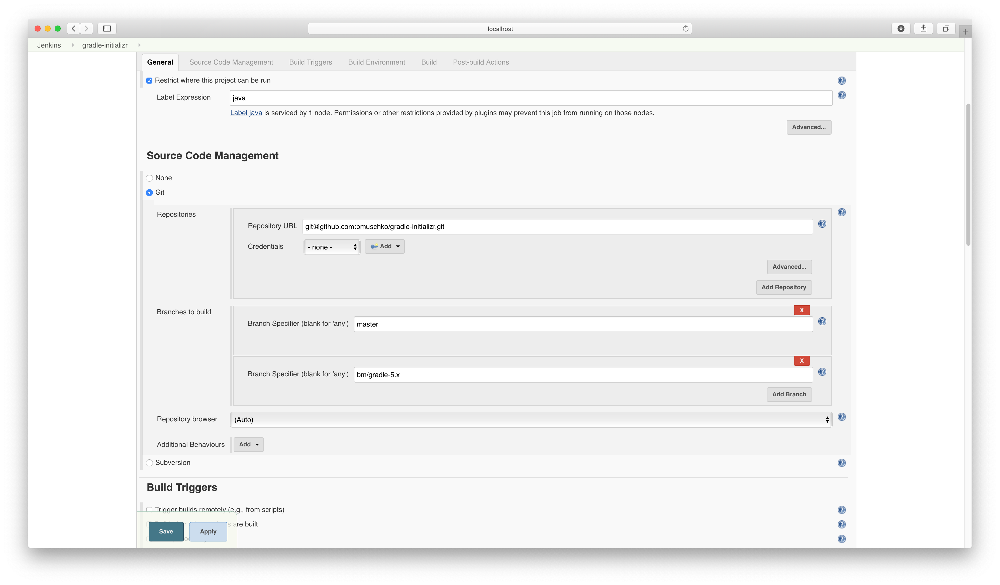
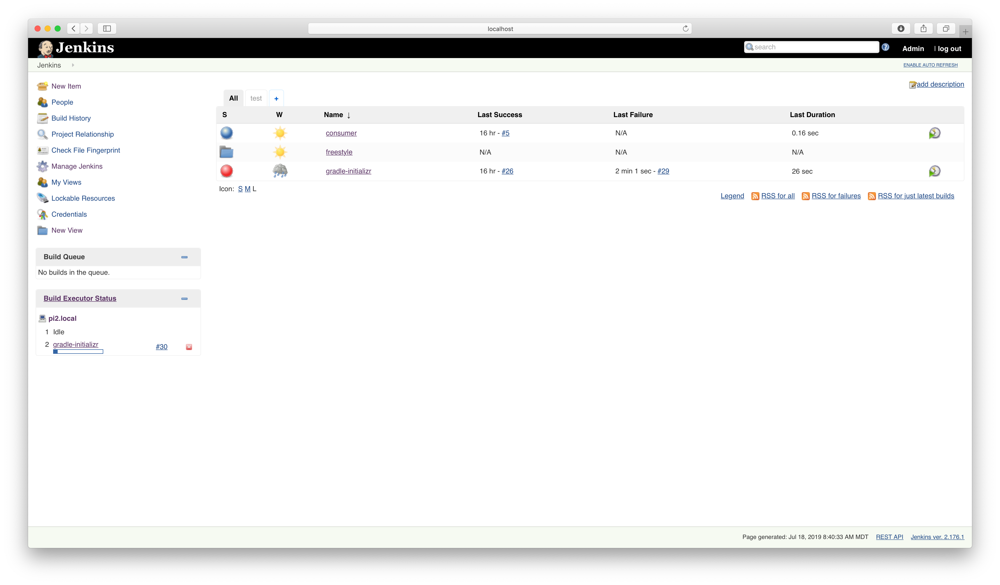
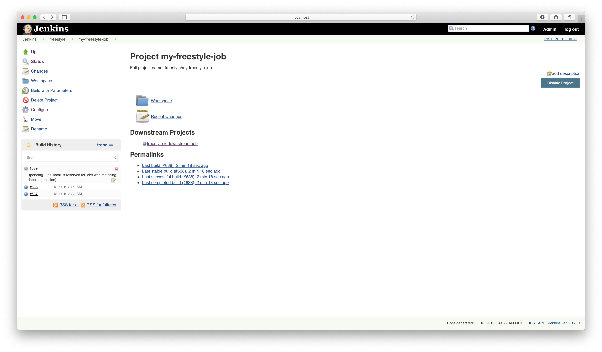

# Solution

Configure the `master` node.

Add a new agent node.

You will see that the `master` node isn't even listed anymore in the executor overview.

Reconfigure the agent node to only build jobs with a specific label.

Reconfigure the job to only use agents that can handle a specific label.

A build of the job is now only handled by an agent with the assigned label.

Other jobs sit in a queue waiting for an agent that can handle the execution criteria.

