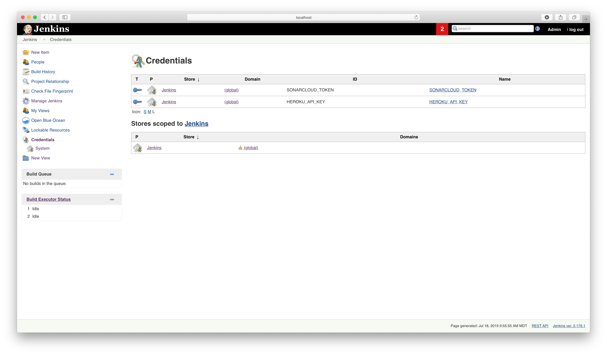
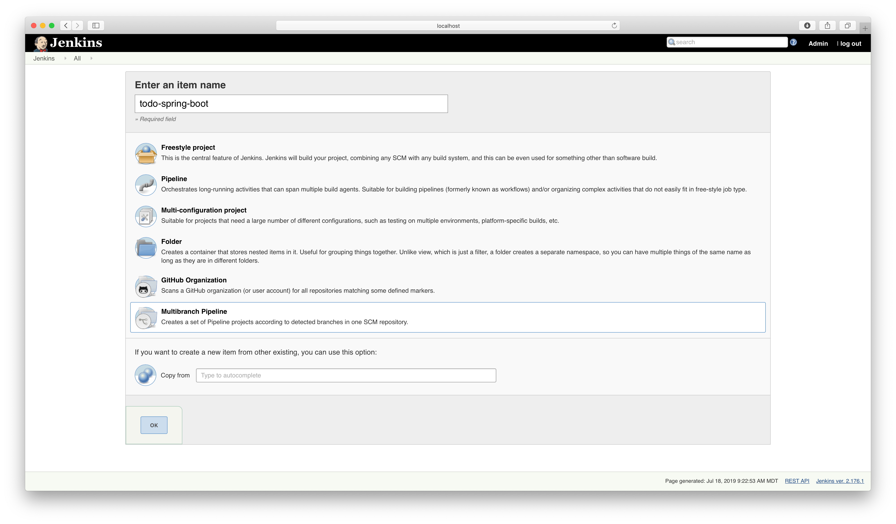
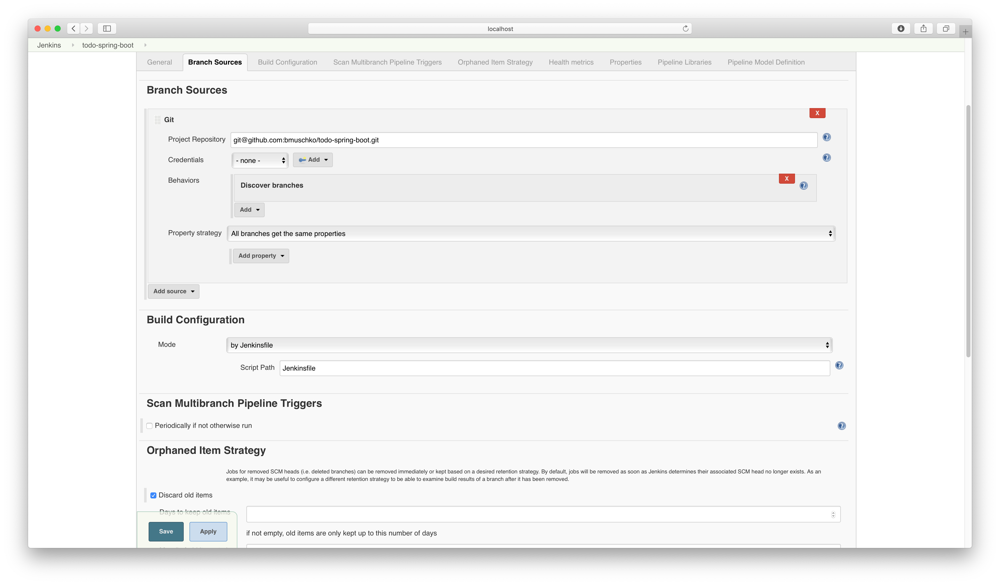
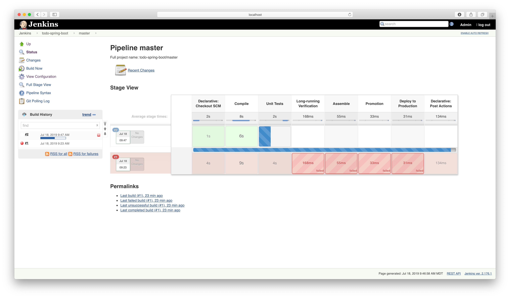
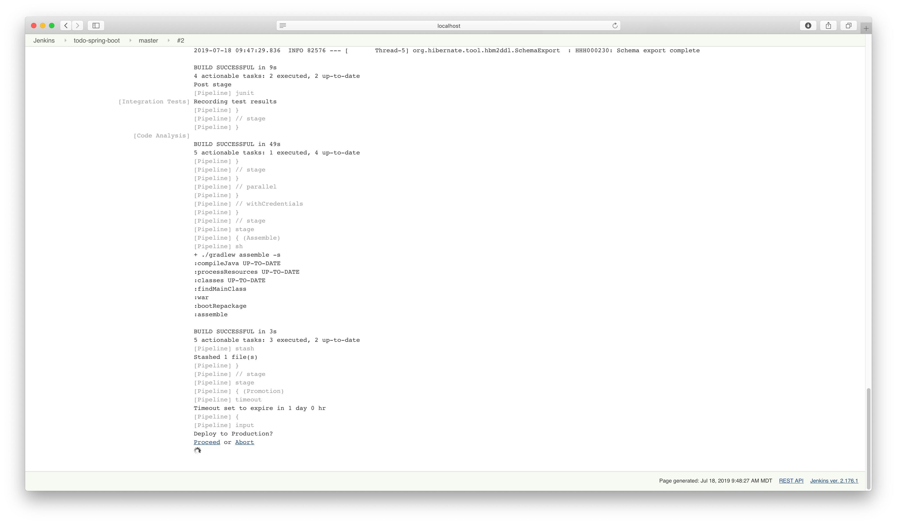
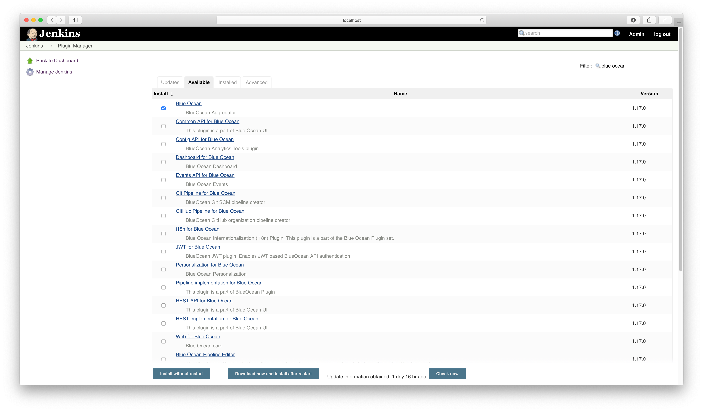
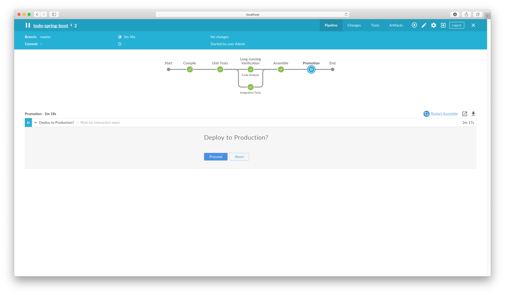
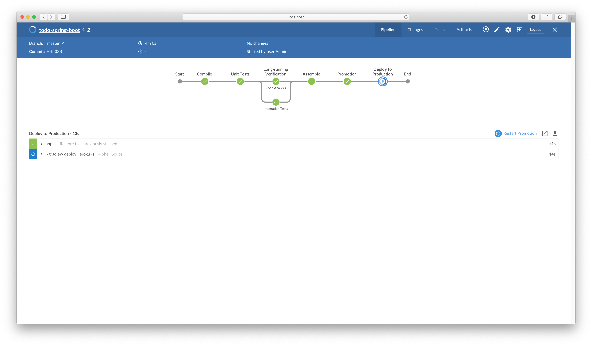
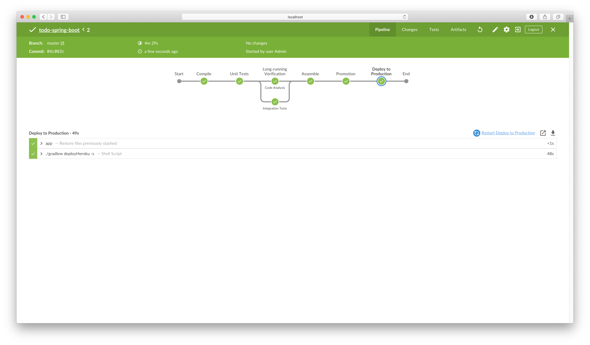
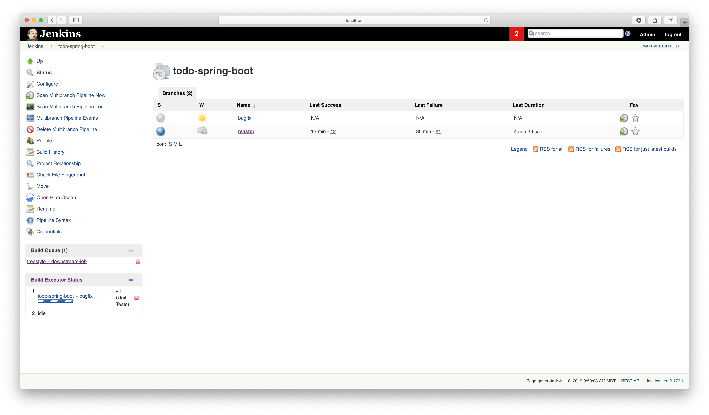

# Solution

The created credentials required for the job.



Create a new item from the dashboard.



Point the job to the SCM.



Upon pressing the OK button, the job will scan all available branches in the repository.

```bash
Started
[Thu Jul 18 09:23:53 MDT 2019] Starting branch indexing...
 > git --version # timeout=10
 > git ls-remote --symref git@github.com:bmuschko/todo-spring-boot.git # timeout=10
Creating git repository in /Users/bmuschko/.jenkins/caches/git-a68a5e08a54549aaef01872e9adb6218
 > git init /Users/bmuschko/.jenkins/caches/git-a68a5e08a54549aaef01872e9adb6218 # timeout=10
Setting origin to git@github.com:bmuschko/todo-spring-boot.git
 > git config remote.origin.url git@github.com:bmuschko/todo-spring-boot.git # timeout=10
Fetching & pruning origin...
Listing remote references...
 > git config --get remote.origin.url # timeout=10
 > git --version # timeout=10
 > git ls-remote -h git@github.com:bmuschko/todo-spring-boot.git # timeout=10
Fetching upstream changes from origin
 > git config --get remote.origin.url # timeout=10
 > git fetch --tags --force --progress origin +refs/heads/*:refs/remotes/origin/* --prune
Checking branches...
  Checking branch master
      ‘Jenkinsfile’ found
    Met criteria
Scheduled build for branch: master
Processed 1 branches
[Thu Jul 18 09:23:57 MDT 2019] Finished branch indexing. Indexing took 4 sec
Finished: SUCCESS
```

You can see the different stages of the pipeline in the standard view.



You can see the different stages of the pipeline in the standard view.


To console output allows for triggering or aborting the manual deployment step.



Install the Blue Ocean plugin.



The Blue Ocean pipeline view offers a UI element for triggering a manual step.



Press the button for processing with the manual step.



The finished pipeline in Blue Ocean.



Check out the repository and push a new branch.

```bash
$ git clone git@github.com:bmuschko/todo-spring-boot.git
Cloning into 'todo-spring-boot'...
remote: Enumerating objects: 230, done.
remote: Total 230 (delta 0), reused 0 (delta 0), pack-reused 230
Receiving objects: 100% (230/230), 108.69 KiB | 452.00 KiB/s, done.
Resolving deltas: 100% (105/105), done.
$ cd todo-spring-boot
$ git branch bugfix
$ git checkout bugfix
Switched to branch 'bugfix'
$ git push origin bugfix
Total 0 (delta 0), reused 0 (delta 0)
remote:
remote: Create a pull request for 'bugfix' on GitHub by visiting:
remote:      https://github.com/bmuschko/todo-spring-boot/pull/new/bugfix
remote:
To github.com:bmuschko/todo-spring-boot.git
 * [new branch]      bugfix -> bugfix
```

After scanning the repository, the new branch will be available and was triggered to build automatically.

