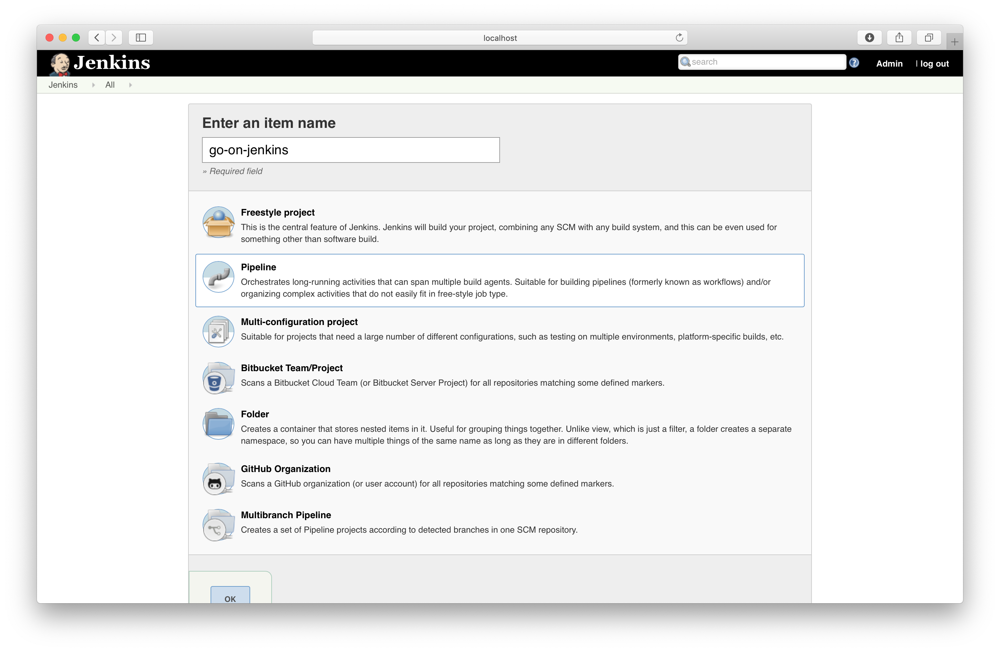
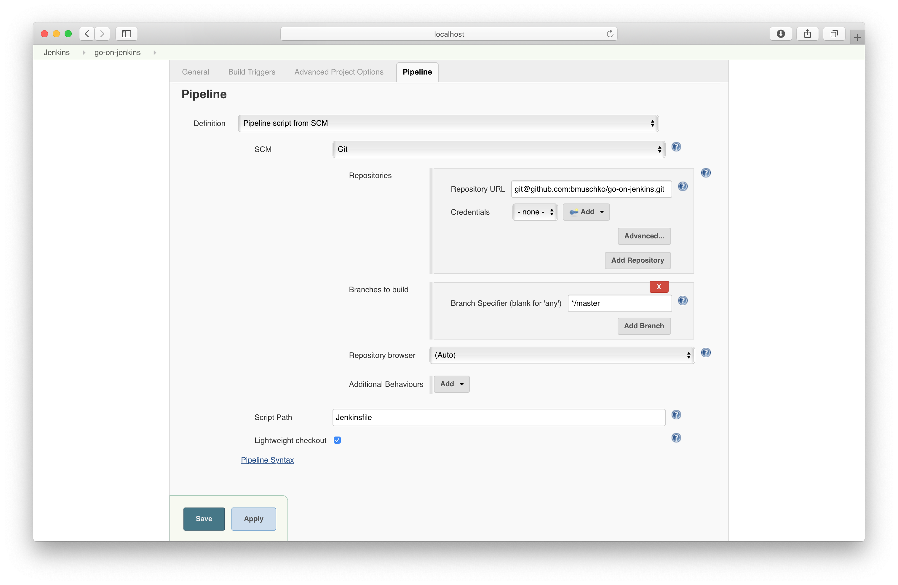
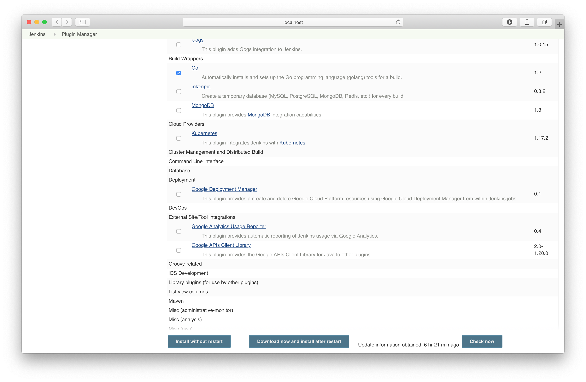
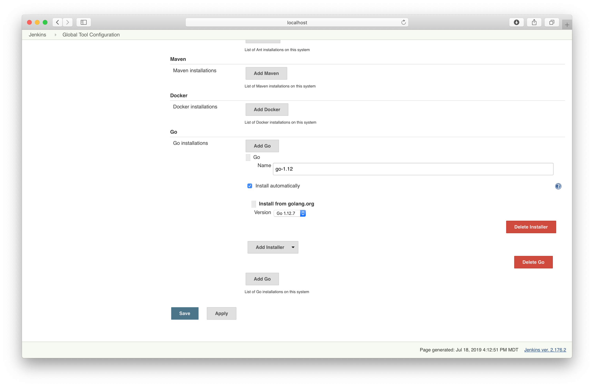
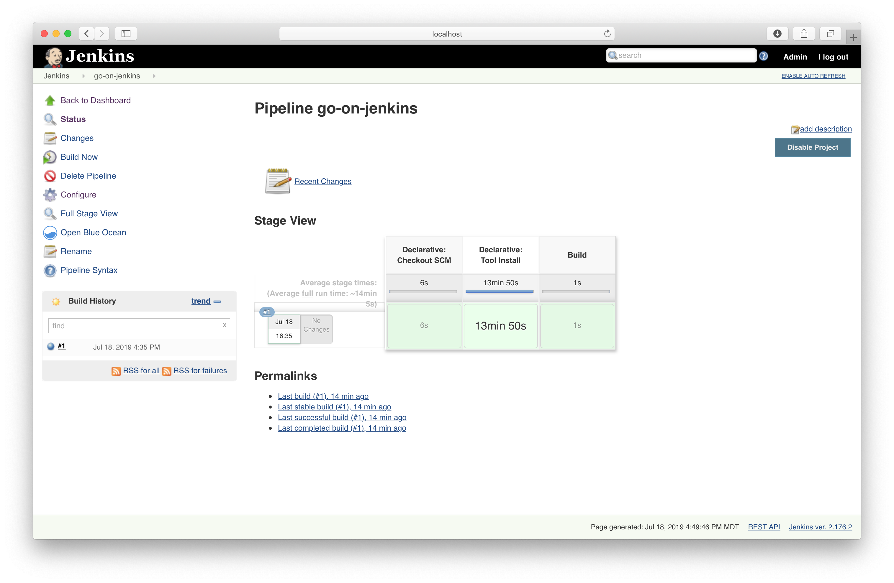

# Solution

Create a new job.



Configure the appropriate SCM.



Install the Go plugin.



Configure a Go runtime as global tool.



The `main.go` file could similar to the one below.

```go
package main

import "fmt"

func main() {
    fmt.Println("hello world")
}
```

The final `Jenkinsfile` looks similar to the solution below.

```groovy
pipeline {
    agent any
    tools {
        go 'go-1.12'
    }
    environment {
        GO111MODULE = 'on'
    }
    stages {
        stage('Build') {
            steps {
                sh 'go build'
            }
        }
    }
}
```

A build of the job installs the Go runtime and executes the build step.

