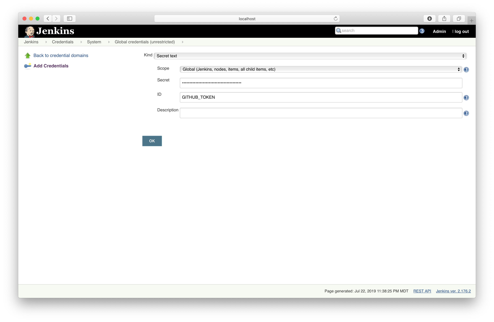

# Solution

Create the credentials for the CodeCov token.


You can implement the "Test" stage as follows.

```groovy
stage('Test') {
    environment {
        CODECOV_TOKEN = credentials('CODECOV_TOKEN')
    }
    steps {
        sh 'go test ./... -coverprofile=coverage.txt'
        sh "curl -s https://codecov.io/bash | bash -s -"
    }
}
```

You can implement the "Code Analysis" stage as follows.

```groovy
stage('Code Analysis') {
    steps {
        sh 'curl -sfL https://install.goreleaser.com/github.com/golangci/golangci-lint.sh | bash -s -- -b $GOPATH/bin v1.17.1'
        sh 'golangci-lint run'
    }
}
```

Create the credentials for the GitHub token.



You can implement the "Release" stage as follows.

```groovy
stage('Release') {
    when {
        buildingTag()
    }
    environment {
        GITHUB_TOKEN = credentials('GITHUB_TOKEN')
    }
    steps {
        sh 'curl -sL https://git.io/goreleaser | bash'
    }
}
```