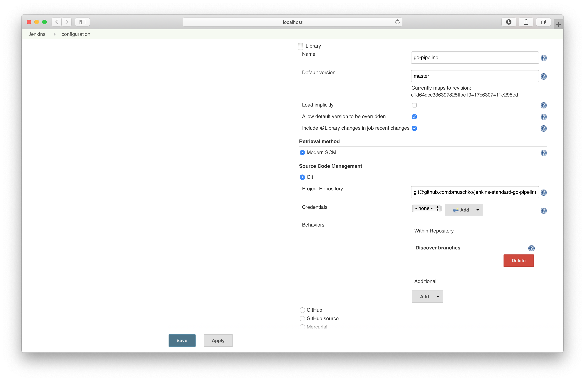
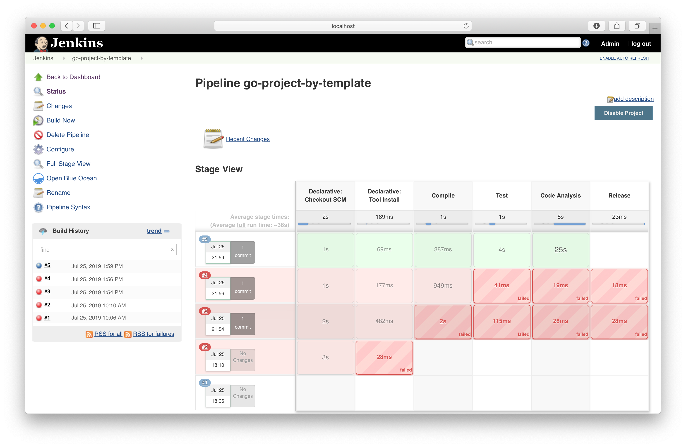

# Solution

The directory structure of shared library repository should have the following structure.

```
.
└── vars
    └── standard.groovy

1 directory, 1 file
```

Define the pipeline as global variable in the file `standard.groovy`.

```groovy
def call(String goToolName = 'go-1.12', String golangCiVersion = 'v1.18.0') {
    pipeline {
        agent any
        tools {
            go "$goToolName"
        }
        environment {
            GO111MODULE = 'on'
        }
        stages {
            stage('Compile') {
                steps {
                    sh 'go build'
                }
            }
            stage('Test') {
                steps {
                    sh 'go test ./... -coverprofile=coverage.txt'
                    sh "curl -s https://codecov.io/bash | bash -s -"
                }
            }
            stage('Code Analysis') {
                steps {
                    sh "curl -sfL https://install.goreleaser.com/github.com/golangci/golangci-lint.sh | bash -s -- -b $GOPATH/bin $golangCiVersion"
                    sh 'golangci-lint run'
                }
            }
            stage('Release') {
                when {
                    buildingTag()
                }
                environment {
                    GITHUB_TOKEN = credentials('GITHUB_TOKEN')
                }
                steps {
                    sh 'curl -sL https://git.io/goreleaser | bash'
                }
            }
        }
    }
}
```

Configure the shared library under _Manage Jenkins > Configure System_.



The directory structure should look as shown below.

```
.
├── Jenkinsfile
├── go.mod
└── main.go

0 directories, 3 files
```

The `Jenkinsfile` uses the shared library and calls the global variable. Optionally, you can configure the pipeline by passing in parameters.

```groovy
@Library('go-pipeline') _

standard()
```

The resulting build will go through all the pipeline stages defined in the shared library.

